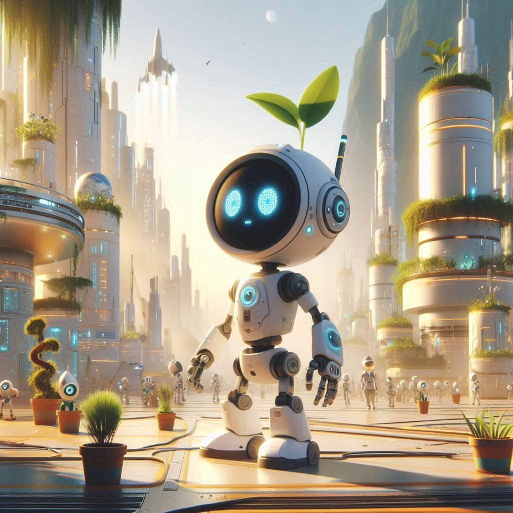

# EcoBots

## Description:
The code for a Survival/Life Simulation Game made for my Rainbow Academy thesis in one month.

## Features:
All customizable:

Menu System
-Locomotion System
-Character Personalization System
-Video and Sound Personalization System
-Quest System
-Money System
-Stats System
-HUD System
-Villagers System
-Inventory System
-Interaction System
-Build System
-Gathering Resources System
-Save Data System
-Day/Night System
-Catastrophes / World Condition System
-Procedural Level Generation
  
## How to Use:
0. Create a Unreal Engine project
1. Copy Source classes and import HUD plugin
2. Setup in Engine to build Your game

## Demonstration:

 [Homemade Trailer](https://www.youtube.com/watch?v=kqqsrD_bwwg)   |
 [Demo Gameplay](https://youtu.be/k9NGu7PUEW0)

 ## Download:
 [Itch.io](https://cyborg3000.itch.io/ecobots)
 
## Technologies Used:
-Unreal Engine 5.2.1

This game was created by [Emanuele Pardini](http://emanuelepardini.altervista.org/). Enjoy!
